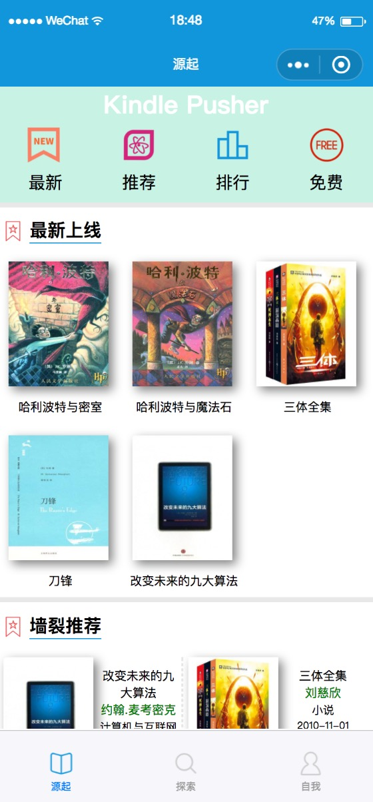
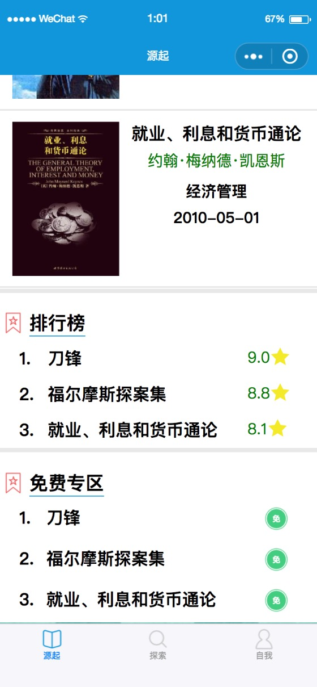

# KindlePusher V2.0
---2018.4.18---  
~~1.0开发告一段落。。~~  
---2018.5.7----  
Duang~~ 2.0!!  

> 一个可以搜索kindle电子书和一键推送到kindle到小程序

直接上图吧：

1.0版截图已删

---2018.4.18---  
~~直男审美不忍直视´_>`~~  
---2018.5.7---  
接受VI指导后，档次蹭蹭蹭(滑稽)  

## TODO
1. ~~布局优化~~
2. 数据库建设
3. 加入KB币体系
...

<<<<<<< HEAD
---2018.4.18---  
~~审核是个蛋疼到问题。。~~  
---2018.5.7---  
站点备案第4天，还未通过。。。  
=======
---2018.4.18---
~~审核是个蛋疼到问题。。~~
---2018.5.7---
站点备案第4天，还未通过。。。
>>>>>>> c4efa641f2346aaeba6ea9305f202d3dc6f77f25
