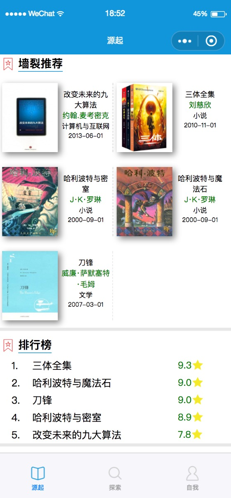
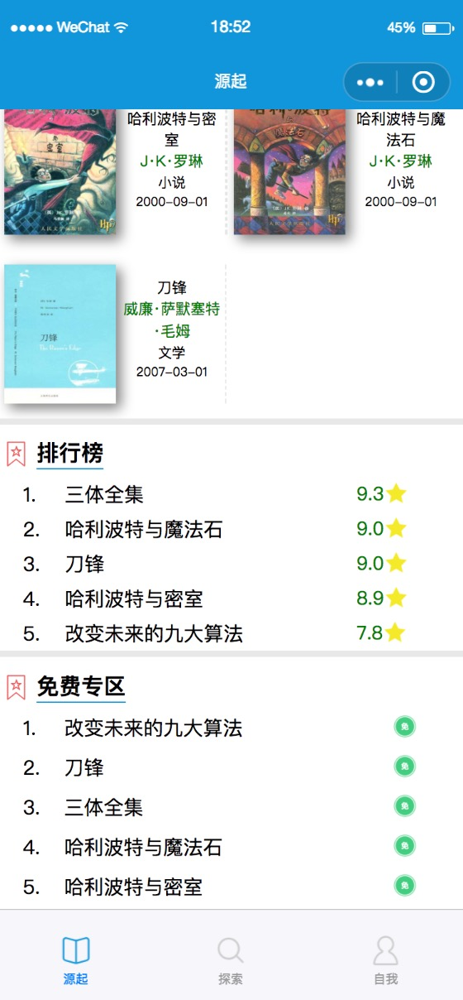
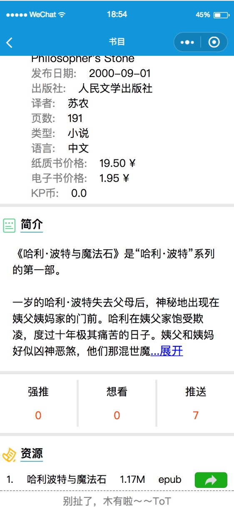

# KindlePusher V2.5
> 一个可以搜索kindle电子书和一键推送到kindle到小程序
### 项目已上线，对此项目有兴趣的朋友可以联系我(邮箱见主页)，后续迭代没那么多时间，不熟悉小程序和后台开发没关系，有js和python经验就行
---2018.4.18---  
~~1.0开发告一段落。。~~  
---2018.5.7----  
~~Duang 2.0!!~~  
---2018.6.9----  
V2.5 改了大部分布局和样式，以及登录逻辑

直接上图吧：

1.0版截图已删

---2018.4.18---  
~~直男审美不忍直视´_>`~~  
---2018.5.7---  
~~接受VI指导后，档次蹭蹭蹭(滑稽)~~  
---2018.6.9---  
优化布局后，档次再次蹭蹭蹭

## TODO
1. ~~布局优化~~
2. ~~数据库建设~~
3. 加入KB币体系
...

---2018.4.18---  
~~审核是个蛋疼到问题。。~~  
---2018.5.7---  
~~站点备案第4天，还未通过。。。~~  
---2018.6.9----  
5月底的时候就正式上线了  
因为等上线的时候在帮朋友做另一个小程序，就没有及时更新了，现在忙完了，上来更新一些东西。

### 虽然项目已经上线了，但一开始就开源了，如有其他用途，务必与我联系

